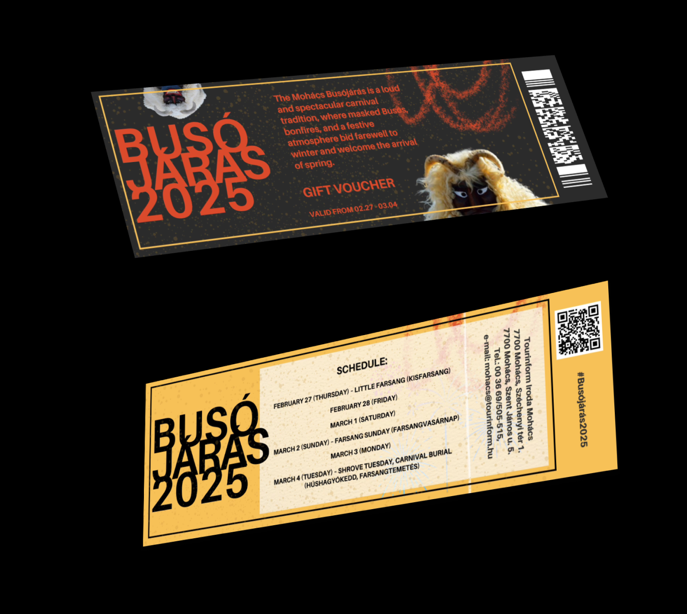

# Busójárás Scratch Ticket 🎭
## A scratch-off digital ticket experience inspired by the famous Mohács Winter Festival in Hungary, where users reveal their fate by brushing away a digital dust layer.

  

### 📋Features:

* **Unique Design:** I created the ticket design entirely from scratch in **Canva** and **Figma**, drawing inspiration from traditional carnival aesthetics.
* **Responsive Layout:**  Adapts to different screen sizes with flexible typography and layout.
* **Accessibility Considerations:** 
	- WCAG-friendly colors and contrasts.
	- Keyboard navigability and focus indicators.
	- Proper use of semantic HTML elements.
* **Interactive Scratch Effect:** Users "scratch" away the dust layer using mouse or touch gestures.
* **Dynamic Ticket Flip:** At random intervals, the ticket flips on its own, revealing the back side.
* **Downloadable Ticket:**	Users can download both sides of their ticket as a single image, or scan the QR code to visit the official festival website.
* **Background Effects:** Subtle ashy textures for a realistic scratched-off feel.

### 🛠️ Tools & Technologies Used
* **Design Tools**: Canva, Figma
* **Development**: HTML, CSS, JavaScript:
	- Semantic structure for better accessibility.
	- Custom styling, animations, and a visually appealing layout.
	- Implements the scratch-off effect, ticket flip, and download functionality.
* **Using HTML5 Boilerplate**
 	- This project was initially set up using HTML5 Boilerplate as a starting point for best practices in frontend development. The boilerplate provided a solid foundation with a well-structured HTML, CSS, and JavaScript setup, which was then extensively customized to implement the scratch-off effect, ticket flip, and accessibility improvements.

### 🖥️ How It Works
* **Scratch Off the Dust** – Use your mouse (or touch) to uncover the ticket.
* **Reveal the Ticket Manually** – If you prefer, press the "Reveal Ticket" button to instantly clear the dust.
* **Watch the Ticket Flip** – At random intervals, the ticket flips on its own, revealing the back side.
* **Download Your Ticket** – Click the "Download Ticket" button to save a copy.
* **Scan or Click the QR Code** – Visit the festival’s official site with one tap.

### 🚀 Accessibility Considerations

* **Keyboard Navigation**: 
 - All interactive elements (buttons, QR code) are reachable via Tab.
 	- Custom focus outlines for clear visibility.
* **Color Contrast & Readability**:
 	- Used high contrast colors (#E4572E for buttons, white text).
 	- Ensured text is large and scales well on different screens.
* **ARIA & Alternative Text**:
 	- QR code has an accessible description.
 	- Images use meaningful alt attributes.

### 📂 Project Structure

	/project-root
	│── /img
	│   ├── 3D.png
	│   ├── dust_cover.jpg
	│   ├── qrcode.svg
	│   ├── ticket-back.png
	│   ├── ticket-front.png
	│   ├── video.gif
	│── /css
	│   ├── style.css
	│── /js
	│   ├── app.js
	│── index.html
	│── README.md

### ✨ Live demo
[Here](https://boglarkasebestyen.github.io/devto_02challenge2025/)

### 🛠️ Installation & Setup
**Clone the repository**:
git clone [https://github.com/boglarkasebestyen/busojaras-ticket.git](), open **index.html** in a browser.

### 🎟️ Future Improvements

* Adding a mobile-friendly gesture-based scratch effect.
* Enhancing the ticket flip animation for a smoother effect.
* Expanding accessibility by providing audio feedback.

### 🎯 Challenge Participation
This project was created as part of the [DEV.to February Frontend Challenge](https://dev.to/devteam/join-us-for-the-next-frontend-challenge-february-edition-3070?bb=210331), focusing on interactive and engaging frontend experiences. My submission can be viewed [here](https://dev.to/boglarkasebestyen/winter-festival-scratch-ticket-4ae2).

### 🌟 Credits
* Festival Inspiration: [Busójárás / Mohács Winter Festival in Hungary](https://www.mohacsibusojaras.hu)
* Images from [Pexels](https://www.pexels.com)

